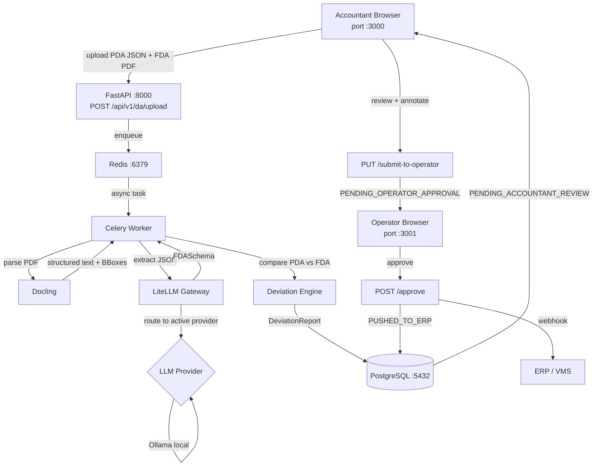

# OpenDA — AI Disbursement Account Analyzer

> Open-source Human-in-the-Loop AI platform for maritime port agency cost validation.  
> Accountants upload a Proforma DA (JSON) + Final DA (PDF). An LLM extracts every line item, flags deviations, and generates a full audit trail — all without lock-in to a specific AI provider.

---

## Architecture



---

## Quick Start

### Prerequisites

| Tool | Version |
|------|---------|
| Docker + Docker Compose | 24+ |
| Python | 3.12+ |
| UV | latest |
| Node.js | 20+ |
| pnpm | 9+ |

### 1. Clone & Configure

```bash
git clone https://github.com/your-org/openda.git
cd openda
cp .env.example .env
```

Edit `.env` and set your LLM provider:

```bash
# Choose ONE provider block:

# Anthropic Claude (recommended)
LLM_MODEL=anthropic/claude-sonnet-4-6-20250514
LLM_API_KEY=sk-ant-...

# Google Gemini
# LLM_MODEL=gemini/gemini-2.0-flash
# LLM_API_KEY=AIza...

# OpenAI
# LLM_MODEL=openai/gpt-4o
# LLM_API_KEY=sk-proj-...

# Ollama (no API key needed)
# LLM_MODEL=ollama/llama3.3
# LLM_API_KEY=ollama
```

### 2. Docker (full stack)

```bash
docker compose up --build
```

| Service | URL |
|---------|-----|
| Accountant UI | http://localhost:3000 |
| Operator UI | http://localhost:3001 |
| API | http://localhost:8000 |
| API docs | http://localhost:8000/docs |

### 3. Local Development

#### Backend (Python)

```bash
cd backend
uv venv
source .venv/bin/activate          # Windows: .venv\Scripts\activate
uv pip install -e ".[dev]"

# start postgres + redis
docker compose up -d postgres redis

# migrate
alembic upgrade head

# run API
uvicorn main:app --reload --port 8000

# run Celery worker (separate terminal)
celery -A app.workers.celery_app worker --loglevel=info
```

#### Frontend

```bash
# Accountant UI (port 5173, proxies /api → :8000)
cd frontend-accountant && pnpm install && pnpm dev

# Operator UI (port 5174)
cd frontend-operator && pnpm install && pnpm dev
```

---

## LLM Provider Reference

OpenDA uses [LiteLLM](https://docs.litellm.ai/) as a universal gateway. Switch providers by changing two env vars — zero code changes required.

| Provider | `LLM_MODEL` | `LLM_API_KEY` |
|----------|-------------|---------------|
| Anthropic Claude | `anthropic/claude-sonnet-4-6-20250514` | Anthropic API key |
| Google Gemini | `gemini/gemini-2.0-flash` | Google AI Studio key |
| OpenAI | `openai/gpt-4o` | OpenAI API key |
| Azure OpenAI | `azure/gpt-4o` | Azure API key |
| Ollama (local) | `ollama/llama3.3` | `ollama` |

For Ollama, also set `OLLAMA_API_BASE=http://localhost:11434`.

---

## API Reference

| Method | Path | Description |
|--------|------|-------------|
| `POST` | `/api/v1/da/upload` | Upload PDA JSON + FDA PDF, starts AI processing |
| `GET` | `/api/v1/da/{id}/status` | Poll DA lifecycle status |
| `GET` | `/api/v1/da/{id}/deviation-report` | Full deviation report with per-item flags |
| `GET` | `/api/v1/da/{id}/audit-log` | Immutable audit trail |
| `PUT` | `/api/v1/da/{id}/submit-to-operator` | Accountant submits reviewed items |
| `POST` | `/api/v1/da/{id}/approve` | Operator approves → fires ERP webhook |
| `POST` | `/api/v1/da/{id}/reject` | Reject at any review stage |
| `GET` | `/api/v1/health` | Health check (DB + Redis + LLM config) |

Full interactive docs: `http://localhost:8000/docs`

---

## Deviation Flags

| Flag | Condition |
|------|-----------|
| `HIGH_DEVIATION` | Absolute variance > $500 **or** percentage variance > 10% |
| `LOW_CONFIDENCE` | AI extraction confidence < 0.85 |
| `MISSING_PDA_LINE` | FDA item has no matching PDA category |
| `MISSING_FROM_FDA` | PDA item absent from FDA |

---

## ERP Webhook

When an operator approves a DA, OpenDA fires a `POST` to `WEBHOOK_URL` with:

```json
{
  "da_id": "uuid",
  "port_call_id": "PC-2024-SGSIN-0001",
  "status": "APPROVED",
  "total_estimated": 12500.00,
  "total_actual": 13050.00,
  "operator_remarks": "Anchorage fees validated against port authority receipt",
  "llm_provider": "anthropic/claude-sonnet-4-6-20250514",
  "approved_at": "2025-01-15T09:32:00Z"
}
```

Set `WEBHOOK_URL=http://your-erp/api/inbound/disbursement` in `.env`.  
For local testing: `WEBHOOK_URL=http://localhost:8000/api/v1/da/webhook-echo`

---

## DA Lifecycle

```
UPLOADING → AI_PROCESSING → PENDING_ACCOUNTANT_REVIEW
                         ↗  (retry on failure)
                  → PENDING_OPERATOR_APPROVAL
                         → APPROVED → PUSHED_TO_ERP
                         → REJECTED
```

---

## Testing

```bash
cd backend

# Generate synthetic test fixtures (5 PDA JSONs + 5 FDA PDFs)
python ../test_data/generate_fixtures.py

# Run schema smoke tests
python ../test_data/smoke_test_schemas.py

# Run pytest suite
pytest tests/ -v
```

---

## Project Structure

```
openda/
├── backend/                    # FastAPI + Celery + SQLAlchemy
│   ├── app/
│   │   ├── api/routes/         # da.py, health.py
│   │   ├── models/             # SQLAlchemy ORM models
│   │   ├── schemas/            # Pydantic v2 schemas (PDA, FDA, deviation)
│   │   ├── services/           # llm_provider, extraction_service, deviation_engine, state_machine
│   │   └── workers/            # Celery app + tasks
│   ├── alembic/                # DB migrations
│   └── main.py
├── frontend-accountant/        # React + Vite (split-screen PDF review)
├── frontend-operator/          # React + Vite (approval dashboard)
├── test_data/                  # Synthetic PDA/FDA fixtures
├── docker-compose.yml
└── .env.example
```

---

## Contributing

1. Fork → feature branch → PR against `main`
2. Run `ruff check .` and `mypy` before pushing
3. Add tests for any new business logic in `backend/tests/`

---

## License

MIT — see [LICENSE](LICENSE)
